# CSE151A-WI23-Project

Jupiter Notebook: https://drive.google.com/file/d/1RqJJukdvk2iLKsriBnT8vFXMK4Qp7YE7/view?usp=sharing

## Dataset
https://archive.ics.uci.edu/dataset/2/adult

## Abstract
This dataset contains information about demographic and job-related features of individuals, such as age, work class, education, and occupation. This data can then be used to predict whether a person makes over 50k a year, based solely on these features. Additionally, it can also be used to predict if one or multiple features affects another. We will be doing some form of regression in order to predict whether these features affect one another or overall income.

## Background
The data was extracted by Barry Becker from the 1994 Census database, and the goal is to determine whether an individual makes over $50,000 a year based on demographic and job-related information.

## Introduction
We were interested in this dataset because it was very robust, and had potential for a variety of different tasks to be completed using it. In addition to the prediction task, we considered exploring whether different variables influence each other (e.g. income vs. marital status, correlation between age/education/occupation); for these tasks, we would perform regression, classification, and/or clustering. Our main objective is to determine how individual features affect each other as well as to get an idea of how our own futures may look. As college students graduating within the next couple years, we are curious to see what types of jobs that we potentially end up in, as well as how our backgrounds and education can predict our future careers. We can also get a better idea of how and where underprivileged demographics fall behind, and consider what can be done in order to uplift those groups. By the completion of this project, we hope to gain a better understanding of how people's backgrounds and education play a role in their future.

## Figures
Figures will be mainly shown in the data exploration part of our writeup as well as in our models.

## Methods

### Data Exploration
We used Seaborn to visualize our data. Specifically, we used a pairplot and histograms of many different variables to visualize the distributions of our data more clearly.

```
# Visualize the data

# Important note:
# Run imputation and then transformation before data visualization! This is so
# we don't map null values, we don't categorize null values, and don't
# map unnecessary columns

sns.pairplot(X)

sns.histplot(X['age'], bins=10);
plt.title('Age Distribution')
plt.show()

education_mapping = {
    1: 'Preschool',
    2: '1st-4th',
    3: '5th-6th',
    4: '7th-8th',
    5: '9th',
    6: '10th',
    7: '11th',
    8: '12th',
    9: 'HS-grad',
    10: 'Some-college',
    11: 'Assoc-voc',
    12: 'Assoc-acdm',
    13: 'Bachelors',
    14: 'Masters',
    15: 'Prof-school',
    16: 'Doctorate'
}
sns.countplot(x='education-num', data=X);
legend_handles = [plt.Line2D([0], [0], marker='o', color='w', markerfacecolor='b', markersize=10)]
legend_labels = ['Education Level']
for num, edu in education_mapping.items():
    legend_handles.append(plt.Line2D([0], [0], marker='o', color='w', markerfacecolor='b', markersize=10))
    legend_labels.append(f"{num}: {edu}")

plt.legend(legend_handles, legend_labels, bbox_to_anchor=(1.05, 1), loc='upper left')
plt.title('Education Level Distribution')
plt.show()

sns.histplot(X['hours-per-week'], bins=10);
plt.title('Hours Distribution')
plt.show()

sns.countplot(x='sex', data=X);
plt.title('Sex Distribution')
plt.show()

sns.countplot(x='income', data=y);
plt.title('Income Distribution')
plt.show()
```

### Preprocessing
To preprocess our data, we begun with imputation to remove meaningless or null entries. We had to store the missing row numbers into an array and also remove those data points on our target variable 'y' to keep the data shapes the same.
```
# Shallow copy of X
temp = X.copy()

# Store missing row numbers into array
missing_rows_indices = temp[(temp.isnull().any(axis=1)) | (temp['relationship'] == 'Other-relative')].index

# Drop all rows with missing data in features dataframe
X = X.dropna()
# Removing rows with "other-relative" since we can't make meaningful
# observations of it
X = X[X['relationship'] != 'Other-relative']

# Do the same with targets dataframe
y = y.drop(missing_rows_indices)
```

Additionally, we made some slight transforms to the data to further eliminate unnecessary data. 

```
# There are labels with a period at the end of '<=50K' or '>50K', remove them
y['income'] = y['income'].replace({'<=50K.': '<=50K'})
y['income'] = y['income'].replace({'>50K.': '>50K'})

# Dropping the 'education' column, since we have education_num and don't need
# the extra column
X.drop('education', axis=1, inplace=True)

# Calculating 'net-capital-gain' and dropping 'capital-gain' and 'capital-loss'
X['net-capital-gain'] = X['capital-gain'] - X['capital-loss']
X.drop(['capital-gain', 'capital-loss'], axis=1, inplace=True)
```

We then normalized the data and did a logistic regression using only the numerical data. Further standardization of the normalized numerical data was performed.

```
# Normalize (or standardize)

from sklearn.preprocessing import StandardScaler, MinMaxScaler
from sklearn.compose import ColumnTransformer

# Here we standardize the numerical columns
num_cols = X.select_dtypes(include=['int', 'float']).columns.tolist()
cat_cols = X.select_dtypes(include=['object']).columns.tolist()

transformers = [
    ('STD', StandardScaler(), num_cols)
]

ct = ColumnTransformer(transformers, remainder='passthrough')
transformed = ct.fit_transform(X)

cols = num_cols + cat_cols

X_std_df = pd.DataFrame(transformed, columns=cols)

# Now that we've standardized, I think it's best to use it for logistic regression
# For standardization
X = X_std_df
```

Finally, we performed both label and one-hot encoding on the categorical variables in our data, and determined that label encoding is a more appropriate approach due to the large number of ordinal categorical features. 

```
# Encode (label vs one-hot)
# Small note: make sure you run imputation before this function
# so that it doesn't categorize null values with a number

# label encoding
def enumerate_labels(dataset, string_labels):
  df = dataset.copy(deep=True)
  for label in string_labels:
    uniques = df[label].unique();
    conv_dict = {i:j for i,j in zip(uniques, range(1, len(uniques)+1))}
    df[label] = df[label].map(conv_dict)
  return df
X_label = enumerate_labels(X, ['workclass', 'race', 'native-country', 'occupation',
                         'relationship','marital-status', 'sex'])

# one-hot encoding
def encoding_pipeline(dataset, string_labels):
  df = dataset.copy(deep=True)
  encoder = OneHotEncoder(sparse_output=False)
  encoded_columns = encoder.fit_transform(df[string_labels])
  encoded_df = pd.DataFrame(encoded_columns, columns=encoder.get_feature_names_out(string_labels))
  df = pd.concat([df, encoded_df], axis=1)
  df.drop(string_labels, axis=1, inplace=True)
  return df
X_encode = encoding_pipeline(X, ['workclass', 'race', 'native-country', 'occupation',
                         'relationship','marital-status', 'sex'])

# Label encoding imposes an ordinal relationship, but its less confusing ...
X = X_label

# Let's also encode our target
#y.loc[y['income'] == '>50K', 'income'] = 1
#y.loc[y['income'] == '<=50K', 'income'] = 0

y['income'] = y['income'].map({'>50K': 1, '<=50K': 0})
```


### Model 1: Logistic Regression

We first split the data set into training and testing sets using a 20% test size and a random state of 21. Then, we instantiated the logistic regression model with a maximum iteration parameter set to 5000 and fit it to the training data.

```
trainX, testX, trainY, testY = train_test_split(X,y,test_size=0.2,random_state = 21)

# apparently you need to do this for logistic regression since it doesn't work
# with objects. Making the dependent variable an int.
trainY = trainY.astype('int')
testY = testY.astype('int')

# Let's see these logistics
from sklearn.linear_model import LogisticRegression

# Fit model. Max iter = 5000 for arbitrary reasons
logreg = LogisticRegression(max_iter = 5000)
logreg.fit(trainX, trainY)
```

### Model 2: Keras ANN

First, we got a new split of the data with a 20% test size and a random state of 99. Then, using Keras, we initialized a Sequential model and configured it with one input layer, multiple hidden layers, and one output layer. The input layer was set to have 512 units and had 12 inputs to match the features. Every hidden layer had it's units cut down by 2 until we reached the 1 unit output layer, which uses a sigmoid activation function for binary classification. We compiled the model with the Stochastic Gradient Descent ('sgd' in the model compilation code) optimizer and binary crossentropy for loss function. Then, we fit it to the training data.

Additionally, hyperparameter tuning was done using Keras Tuner to find the optimal units in the dense layers (search range from 4 to 64 units) to find the optimal model configuration for accuracy. K-fold cross-validation was also implemented to make sure we did not overfit.

```
# new split of train/test vars
trainX_2, testX_2, trainY_2, testY_2 = train_test_split(X,y,test_size=0.2,random_state = 99)

display(X_train.shape)
display(y_train.shape)

from keras.models import Sequential
from keras.layers import Dense

# initialize ANN
classifier = Sequential()

# input layer
classifier.add(Dense(units = 512, activation = 'relu', input_dim = 12))

# hidden layers
classifier.add(Dense(units = 256, activation = 'relu'))
classifier.add(Dense(units = 128, activation = 'relu'))
classifier.add(Dense(units = 64, activation = 'relu'))
classifier.add(Dense(units = 32, activation = 'relu'))
classifier.add(Dense(units = 16, activation = 'relu'))
classifier.add(Dense(units = 8, activation = 'relu'))
classifier.add(Dense(units = 4, activation = 'relu'))
classifier.add(Dense(units = 2, activation = 'relu'))

# output layer
classifier.add(Dense(units = 1, activation = 'sigmoid'))

# takes a long time to train because of large dataset, change batch_size/epochs if necessary
classifier.compile(optimizer = 'sgd', loss = 'binary_crossentropy')
history = classifier.fit(trainX_2.astype(int), trainY_2.astype(int), batch_size = 300, epochs = 100)
```

For the Keras ANN model we also performed hyper-parameter tuning and K-fold cross validation to see if these methods would improve our model.

```
# We may reconstruct the original model but with hyperparameters
!pip install keras_tuner -q
import keras_tuner

from keras.metrics import BinaryAccuracy, BinaryCrossentropy, Precision, Recall
def build_model(hp):
  # initialize ANN8
  classifier = Sequential()
  # input layer
  classifier.add(Dense(units = hp.Int("units", min_value=8, max_value=64, step=2, default=8), activation = 'relu', input_dim = 12))

  for i in range(2):
    classifier.add(Dense(
        units=hp.Int("units", min_value=4, max_value=64, step=2, default=4),
        activation='relu'
    ))

  # hidden layers
  # classifier.add(Dense(units = hp.Int("units", min_value=6, max_value=24, step=6), activation = 'relu'))
  # classifier.add(Dense(units = hp.Int("units", min_value=4, max_value=20, step=5), activation = 'relu'))

  # output layer
  classifier.add(Dense(units = 1, activation = 'sigmoid'))

  # takes a long time to train because of large dataset, change batch_size/epochs if necessary
  # do smaller batch_size/larger epochs for final results to be submitted
  classifier.compile(optimizer = 'sgd', loss = 'binary_crossentropy', metrics=['binary_accuracy'])
  return classifier

hp = keras_tuner.HyperParameters()
hp.Int("units", min_value=4, max_value=64)
tuner = keras_tuner.RandomSearch(
    hypermodel=build_model,
    # hyperparameters=keras_tuner.HyperParameters(),
    objective="binary_accuracy",
    max_trials=5,
    executions_per_trial=2,
    tune_new_entries=True,
    allow_new_entries=True,
    seed=15,
    overwrite=True,
    directory="model_2_randomsearch_tuning",
    project_name="151a_milestone_2"
)
tuner.search(trainX_2.astype(int), trainY_2.astype(int), epochs=2)
best_models_2 = tuner.get_best_models(num_models=2)
```

```
# K-fold Cross Validation
trainX_2_noval, valX_2, trainY_2_noval, valY_2 = train_test_split(trainX_2, trainY_2, random_state=0)
hp = keras_tuner.HyperParameters()
hp.Int("units", min_value=4, max_value=64)
tuner = keras_tuner.RandomSearch(
    hypermodel=build_model,
    # hyperparameters=keras_tuner.HyperParameters(),
    objective="binary_accuracy",
    max_trials=5,
    executions_per_trial=2,
    tune_new_entries=True,
    allow_new_entries=True,
    seed=15,
    overwrite=True,
    directory="model_2_randomsearch_tuning_kfold",
    project_name="151a_milestone_2"
)
tuner.search(trainX_2.astype(int), trainY_2.astype(int), epochs=2, validation_data=(valX_2.astype(int), valY_2.astype(int)))
best_models_2_val = tuner.get_best_models()
```

### Model 3: SVM
```
from sklearn.model_selection import train_test_split
from imblearn.over_sampling import SMOTE
from sklearn.svm import SVC

# split
trainX_3, testX_3, trainY_3, testY_3 = train_test_split(X, y, test_size=0.2, random_state=48)

# class weights to weigh more heavily on the minority class
# class_0_weight = y[y == 0].shape[0] / y.shape[0]
# class_1_weight = y[y == 1].shape[0] / y.shape[0]
class_0_weight = y.loc[y['income'] == 0].shape[0] / y.shape[0]
class_1_weight = y.loc[y['income'] == 1].shape[0] / y.shape[0]
class_weights = {0: class_0_weight, 1: class_1_weight}

# over sampling the minority class
# smote = SMOTE(sampling_strategy='minority', random_state=48)
# trainX_3_smote, trainY_3_smote = smote.fit_resample(trainX_3, trainY_3)

# rbf kernal for our svm and fitting
svm_model = SVC(kernel='rbf', class_weight=class_weights, random_state=48)
#svm_model.fit(trainX_3_smote, trainY_3_smote)
svm_model.fit(trainX_3, trainY_3)

# prediction time
predictions = svm_model.predict(testX_3)
```

## Results

### Data Exploration
(Pairplot is too big to be screenshotted, please check our jupyter notebook to see pairplot)

We first wanted to look at the distribution of our data with figures. For example, here is a histogram of the age distribution of our data:

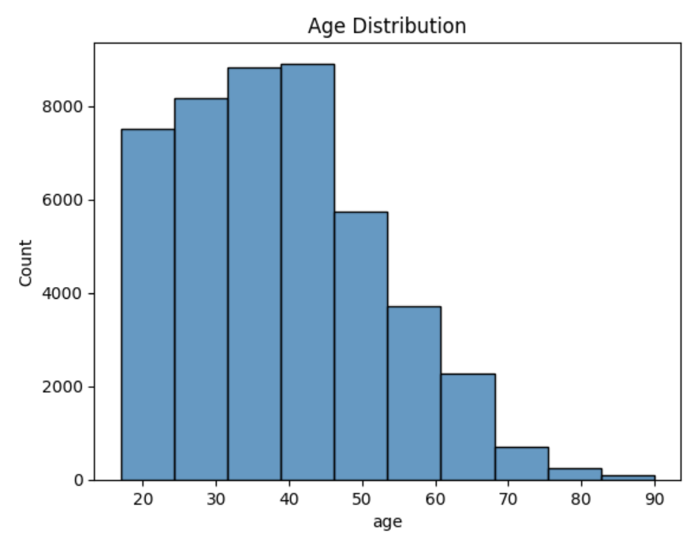

Next we wanted to see the distribution of how many hours per week were worked:

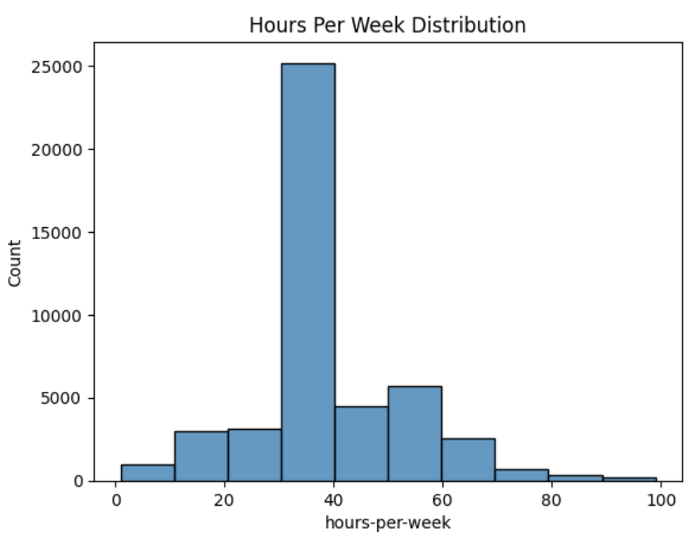

We also wanted to see the education level of our dataset, so we graphed a histogram of education level vs. number of people:

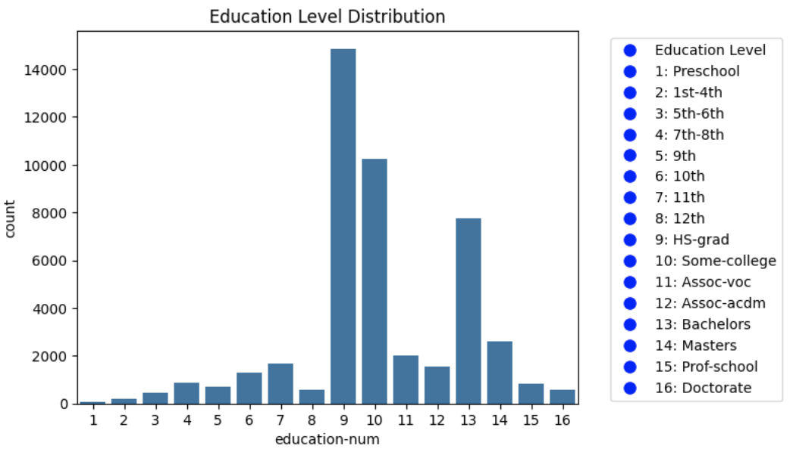

We also wanted to analyze distributions of other variables, such as sex and income:
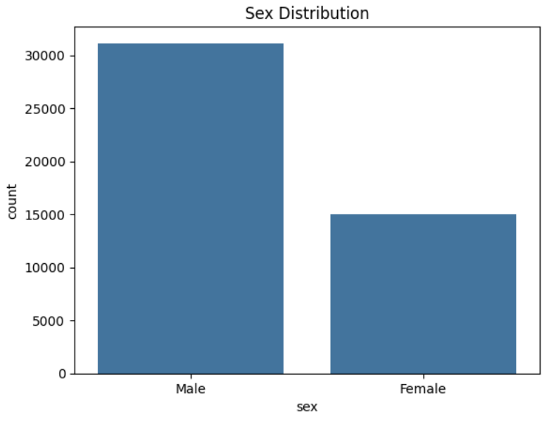
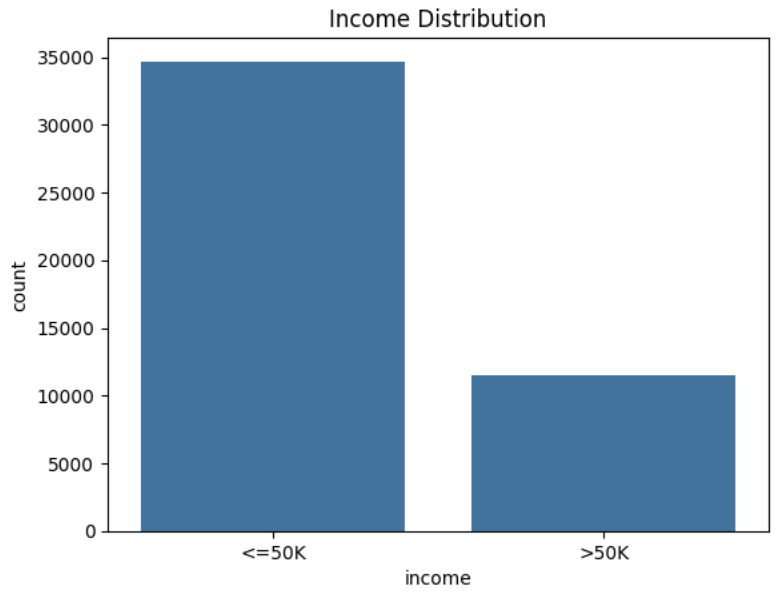

### Preprocessing

After imputation, transformation, normalizing and encoding data, here is a subsample of our data:

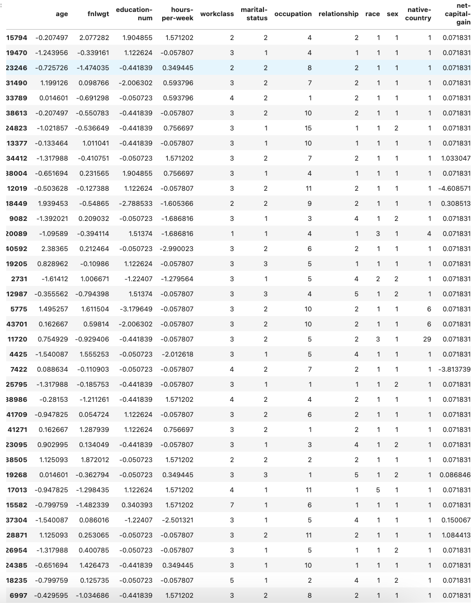

We decided to print a classification report and the log-loss of both our training and test data to evaluate each of our models. We also displayed a training/test error graph over the number of features.
### Model 1: Logistic Regression
```
# Make your bets
yhat_test = logreg.predict(testX)
yhat_train = logreg.predict(trainX)

# 0 is <=50K
# 1 is >50K
from sklearn.metrics import classification_report, confusion_matrix
print("Testing:")
print(classification_report(testY, yhat_test))
print("Training:")
print(classification_report(trainY, yhat_train))

# log loss since we're doing logistic regression
# we use predict_proba to reflect what the model actually predicts
# before filtering it with 1 or 0
from sklearn.metrics import log_loss
log_loss_test = log_loss(testY, logreg.predict_proba(testX))
log_loss_train = log_loss(trainY, logreg.predict_proba(trainX))
print(f"Log Loss (Test): {log_loss_test}")
print(f"Log Loss (Train): {log_loss_train}")
```
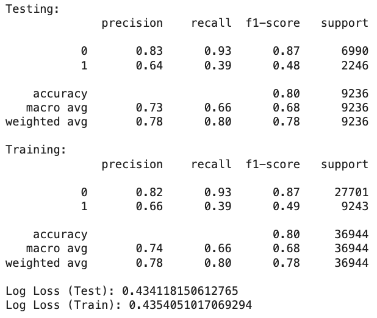

```
import matplotlib.pyplot as plt
train_losses = []
test_losses = []
features = range(1, X.shape[1]+1)
trainY_array = np.array(trainY).flatten()
testY_array = np.array(testY).flatten()
for num_features in features:
    logreg_temp = LogisticRegression(max_iter = 5000)
    logreg_temp.fit(trainX.iloc[:, :num_features], trainY_array)
    train_loss = log_loss(trainY_array, logreg_temp.predict_proba(trainX.iloc[:, :num_features]))
    test_loss = log_loss(testY_array, logreg_temp.predict_proba(testX.iloc[:, :num_features]))
    train_losses.append(train_loss)
    test_losses.append(test_loss)

plt.figure(figsize=(12, 6))
plt.plot(features, train_losses, label='Train Error')
plt.plot(features, test_losses, label='Test Error')
plt.xlabel('Features')
plt.ylabel('Error (Log Loss)')
plt.title('Error per Number of Features')
plt.legend()
plt.show()
```
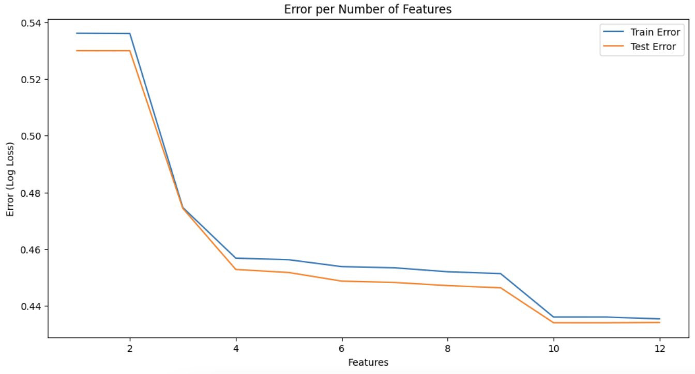

### Model 2: Keras ANN
```
y_pred_prob = classifier.predict(np.asarray(testX_2).astype(np.float32))
y_pred = (y_pred_prob > 0.5).astype(int)
y_pred_flat = y_pred.ravel()

print("Testing:")
print(classification_report(testY_2, y_pred_flat))

y_pred_prob = classifier.predict(np.asarray(trainX_2).astype(np.float32))
y_pred = (y_pred_prob > 0.5).astype(int)
y_pred_flat = y_pred.ravel()

print("Training:")
print(classification_report(trainY_2, y_pred_flat))
```
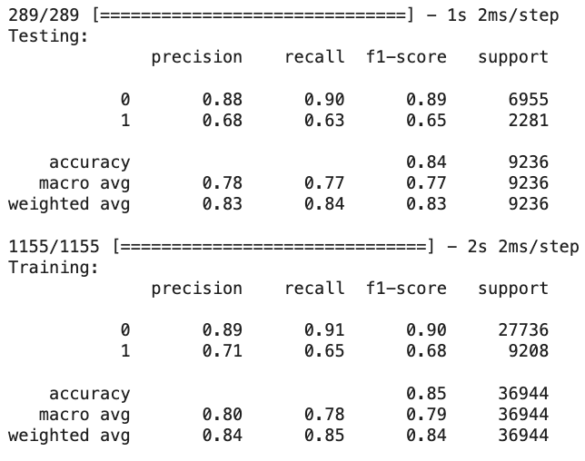

```
log_loss_test = log_loss(testY_2, (classifier.predict(np.asarray(testX_2).astype(np.float32)) > 0.5).astype(int))
log_loss_train = log_loss(trainY_2, (classifier.predict(np.asarray(trainX_2).astype(np.float32)) > 0.5).astype(int))

print(log_loss_test)
print(log_loss_train)
```
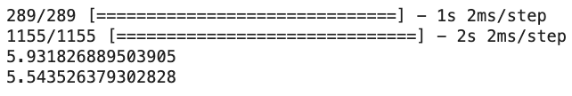

```
train_losses = []
test_losses = []
features = range(1, X.shape[1]+1)
trainY_array = np.asarray(trainY_2).astype(int)
testY_array = np.asarray(testY_2).astype(int)
for num_features in features:
    classifier.fit(trainX_2.astype(int), trainY_array.astype(int), batch_size = 5000, epochs = 10, verbose = 0)
    train_loss = log_loss(trainY_array, classifier.predict(trainX_2.astype(int)))
    test_loss = log_loss(testY_array, classifier.predict(testX_2.astype(int)))
    train_losses.append(train_loss)
    test_losses.append(test_loss)

plt.figure(figsize=(12, 6))
plt.plot(features, train_losses, label='Train Error')
plt.plot(features, test_losses, label='Test Error')
plt.xlabel('Features')
plt.ylabel('Error (Log Loss)')
plt.title('Error per Number of Features')
plt.legend()
plt.show()
```
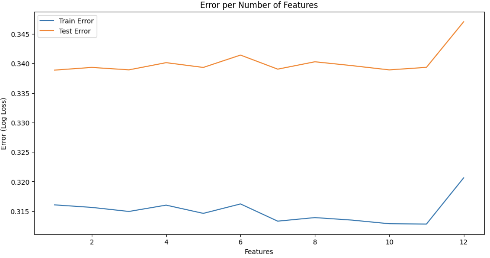

This is the classification report and error graph after performing hyper-parameter tuning and cross-validation:
```
y_pred_prob = classifier.predict(np.asarray(testX_2).astype(np.float32))
y_pred = (y_pred_prob > 0.5).astype(int)
y_pred_flat = y_pred.ravel()

print("Testing:")
print(classification_report(testY_2, y_pred_flat))

y_pred_prob = classifier.predict(np.asarray(trainX_2).astype(np.float32))
y_pred = (y_pred_prob > 0.5).astype(int)
y_pred_flat = y_pred.ravel()

print("Training:")
print(classification_report(trainY_2, y_pred_flat))
```
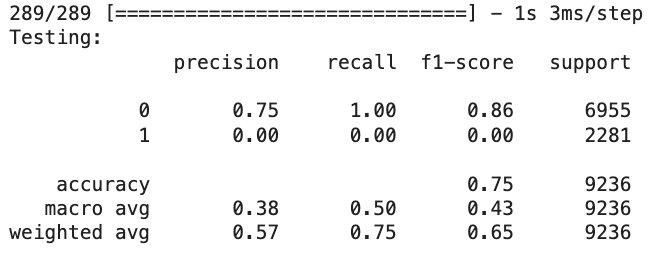
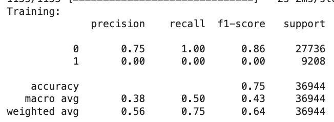

```
log_loss_test = log_loss(testY_2, (classifier.predict(np.asarray(testX_2).astype(np.float32)) > 0.5).astype(int))
log_loss_train = log_loss(trainY_2, (classifier.predict(np.asarray(trainX_2).astype(np.float32)) > 0.5).astype(int))

print(log_loss_test)
print(log_loss_train)
```
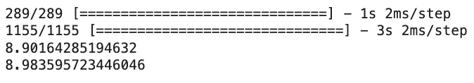

```
train_losses = []
test_losses = []
features = range(1, X.shape[1]+1)
trainY_array = np.asarray(trainY_2).astype(int)
testY_array = np.asarray(testY_2).astype(int)
for num_features in features:
    classifier.fit(trainX_2.astype(int), trainY_array.astype(int), batch_size = 5000, epochs = 10, verbose = 0)
    train_loss = log_loss(trainY_array, classifier.predict(trainX_2.astype(int)))
    test_loss = log_loss(testY_array, classifier.predict(testX_2.astype(int)))
    train_losses.append(train_loss)
    test_losses.append(test_loss)

plt.figure(figsize=(12, 6))
plt.plot(features, train_losses, label='Train Error')
plt.plot(features, test_losses, label='Test Error')
plt.xlabel('Features')
plt.ylabel('Error (Log Loss)')
plt.title('Error per Number of Features')
plt.legend()
plt.show()
```
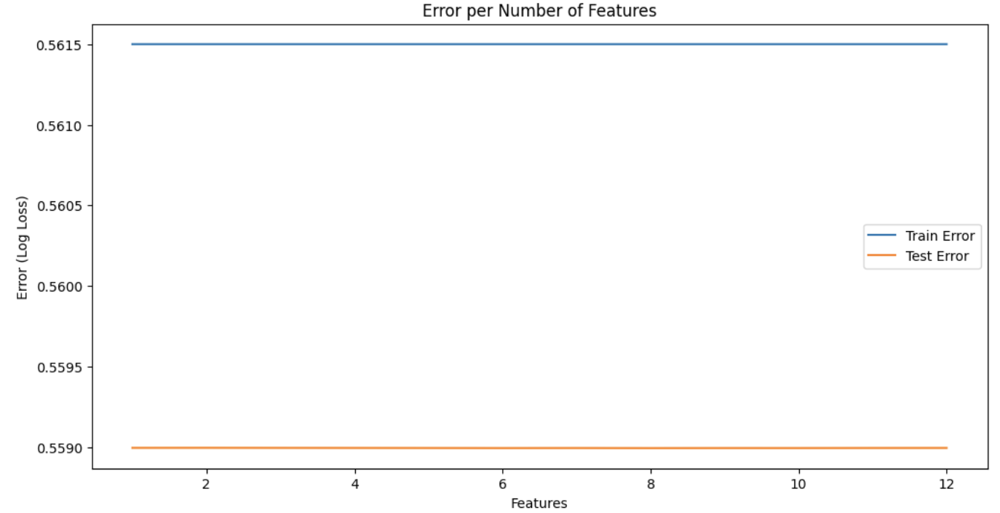

### Model 3: SVM
```
yhat_test = svm_model.predict(testX_3)
yhat_train = svm_model.predict(trainX_3)

# 0 is <=50K
# 1 is >50K
from sklearn.metrics import classification_report, confusion_matrix
print("Testing:")
print(classification_report(testY, yhat_test))
print("Training:")
print(classification_report(trainY, yhat_train))
```
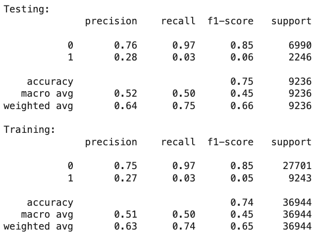

```
from sklearn.metrics import hinge_loss
train_hinge_loss = hinge_loss(trainY_3, svm_model.decision_function(trainX_3))
test_hinge_loss = hinge_loss(testY_3, svm_model.decision_function(testX_3))
print("Training:")
print(train_hinge_loss)
print("Testing:")
print(test_hinge_loss)
```
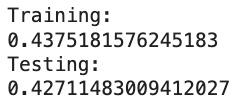

```
train_losses = []
test_losses = []
features = range(1, X.shape[1]+1)
trainY_array = np.array(trainY_3).flatten()
testY_array = np.array(testY_3).flatten()
for num_features in features:
    svm_temp = SVC(kernel='rbf', class_weight=class_weights, random_state=48)
    svm_temp.fit(trainX_3.iloc[:, :num_features], trainY_array)
    train_loss = hinge_loss(trainY_array, svm_temp.decision_function(trainX_3.iloc[:, :num_features]))
    test_loss = hinge_loss(testY_array, svm_temp.decision_function(testX_3.iloc[:, :num_features]))
    train_losses.append(train_loss)
    test_losses.append(test_loss)

plt.figure(figsize=(12, 6))
plt.plot(features, train_losses, label='Train Error')
plt.plot(features, test_losses, label='Test Error')
plt.xlabel('Features')
plt.ylabel('Error (Hinge Loss)')
plt.title('Error per Number of Features')
plt.legend()
plt.show()
```
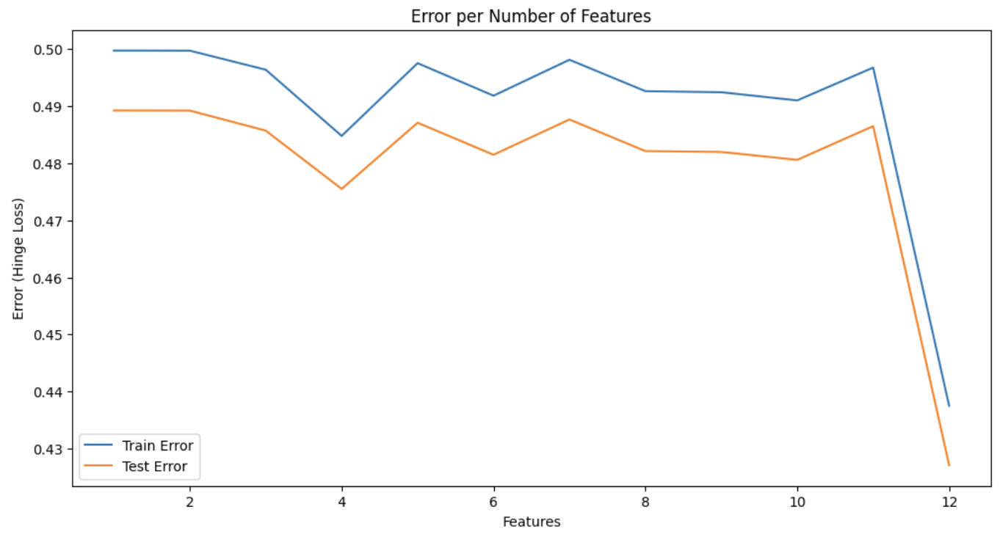

## Discussion

### Data Exploration

Age Distribution: Looking at the figure, we see that the age distribution skews left with the mode being at mid-40s, with a sharp dropdown of people at above age 50. This means that we have a majority younger database in terms of age.

Hours Per Week Distribution: This graph shows that the vast majority of people work 30-40 hour weeks since this unimodal distribution has an extremely massive spike, with the mode representing 25,000 people while every other bar represents less than 5,000 people.

Education Level Distribution: It seems that the highest counts are in education levels 9, 10, 13, which represents high school grad, some college level, and bachelors respectively. These three education levels should make sense as the most common education levels as we have a relatively young age dataset.

Sex and Income Distribution: There is twice as many males as females in this dataset, meaning that males make up two-thirds of our data, which is a very significant bias. Also it seems that there are much more who make less than 50K compared to those who make more than 50K in our dataset. This could lead to some class imbalancing issues when we later run models for this dataset.

### Preprocessing
Overall preprocessing our data to be used for machine learning models was a success. There were some decisions that we could have done differently for our preprocessing such as label vs. one-hot encoding. We felt that label encoding was better as many of our categorical features were ordinal data. We also thought that using MinMaxScaler was the best way to normalize our data since we did not have many outliers that would heavily affect the normalization according to our data exploration. 

### Model 1: Logistic Regression
Our model is consistent throughout the testing and training predictions, and the log loss values are very close. We have high precision and recall for Class 0 (<=50K) but lower precision and significantly lower recall for Class 1 (>50K), likely due to the class imbalance (6000 samples for Class 0 but 2000 for Class 1).
The model is well fit with good generalization, but definitely could benefit from reducing the amount of samples for class 0. We think that it might fit within the ideal range for model complexity, as errors on both test data and train data are low.

We can conclude that our first model has a high accuracy rate for predicting if someone makes less than or equal to 50k, but is much weaker for predicting if they make more than 50k. This was because there was less data for those making over 50k, which led to worse predictions. For future models, we may try making adjustments to the data to reduce the impact of the unbalanced data, or using models that perform relatively well regardless of the number of input entries. We could also perform multiple training runs exclusively on the entries that have income over 50k, to make sure that the model gets to work with it more.

For our next 2 models, we are thinking of using SVM classification to classify who gets what income. We plan on using SVM classification specifically because it is very useful in binary classification and, more importantly, there are methods for us to able to penalize misclassification of the minority class. Additionally, for our second model, we can use a Keras ANN since those are often used to perform prediction / classification tasks with high effectiveness.

### Model 2: Keras ANN
We saw a slight increase in accuracy from our first model, with greatly increased precision and recall for Class 1. Similarly to the first model, it would fit within the ideal range for model complexity due to the fact that there is a small difference between train and test errors. However, it may lean more towards overfitting since the test error appears to be a bit higher than that of the train error.

We performed cross validation and hyperparameter tuning. Grid search seems to have created a stable model that has similar levels of test and train error regardless of number of features. However, the training and testing error are both at least above 0.4. More information needs to be uncovered before we can come to a conclusion on what is good. We will do K-fold cross-validation next.

To figure out what features might be most important, we could use decision trees. Overfitting seems like an issue, however, so careful planning would need to be done. Naive Bayes is not likely to be a good idea because most of the features are likely not independent. If we use it to figure out which features correlate with the target, we would have to carefully choose only the most independent features. We could still try it, but we expect bad results. We are also interested in K-Nearest Neighbors classification because of the unsupervised nature of the approach. It seems useful for exploration because it makes less assumptions about the data. We might be able to use it to lead up to other forms of classification, or as an additional verification measure for decision tree learning. Finally, we are interested in SVM classification for the simple nature of the model. We expect to achieve relatively quick results using it with some polynomial transformations. In the end, we may use all of these methods (minus Naive Bayes) and take an average, using majority vote to generalize the model. Some models might be better for some features, and we could leverage it for much benefit.

In conclusion, we did not find significant improvements by using a neural network. We found good accuracy, but significant overfitting. We believe neither model is truly sufficient, so we would like to try several others.

### Model 3: SVM
We tried SVM with class weights, SVM with over sampling, and both. We kept the version without oversampling and only class weights since it seemed to perform the best. Overall, SVM did not perform well on our data set with a best accuracy of 75% (f-score). This makes it seem like there is no cutoff clear enough for SVM in the data. Our neural network model, the second model, has been our best so far. Further improvements could be attempted using PCA to classify.

## Conclusion

Overall, we achieved fairly decent accuracy with all three of our models. We utilized multiple methods such as cross-validation, hyperparameter tuning, and oversampling to maximize our models and avoid overfitting or underfitting. Although we attained accuracies between 75% to 85%, we believe that our model could be further improved by trying out additional classification models. Since our models have been for binary classification, in the future, we would like to explore predicting a continuous value for income instead of splitting income into binary classes. In doing so, it would be interesting to investigate data for a specific area of work since our current dataset contains a wide range of occupations, making our data very generalized. More data would be required to further enhance the accuracy of our models. However, the work we have done so far provides a good starting point for us to explore more specialized data.

## Collaboration

(Keren and Yoav pair programmed everything they did for this project)

Keren, Coder/Writer: Wrote the description for every feature in the dataset during the preprocessing phase with Yoav, proposed a list of datasets in the beginning of the class and summarized everyone's suggestions. For model 1, changed one-hot encoding to label encoding, set X to be standardized with the pre-existing function (not normalized), trained the logistic regression model on the data and compared its testing and training data, analyzed its location on the fitting graph. Added oversampling to the SVM (for model 3).

Yoav, Coder/Writer: Described every feature in the dataset before the group started working on it in the preprocessing phase with Keren, encoded y to be 0 if <=50K and 1 if >50K (for model 1). For model 2, hyperparameter tuning, training with validation data, evaluation of overfitting, conclusion section, listed a bunch of future models & reasoning why, and suggested several options for next model. For model 3, conclusion section.

Carol, General Organizer: created Github repository and Colab notebook, helped check in with group members to ensure timely completion of milestones, completed some coding and analysis/conclusion cells, often updated readme in Github

Larry, Coder/Writer: I wrote code to imput null/NaN data for data preprocessing and coded all of the figures that show distributions of variables in our dataset; I compiled everything to the requirements in the final writeup except the conclusion.

Chia, Coder: Discussion with other teammates, Preprocessing Encoding code, Model 1 train-test analysis code based on adding features, Model 3 code for SVM model and train-test analysis

Ammie, Coder/Writer: I wrote the code for a few sections in the preprocessing, I assisted in writing the code for testing the accuracies/plotting train and test error for our models as well as provided feedback. Wrote the conclusion for the write up and did checks for the files to make sure they run properly.
